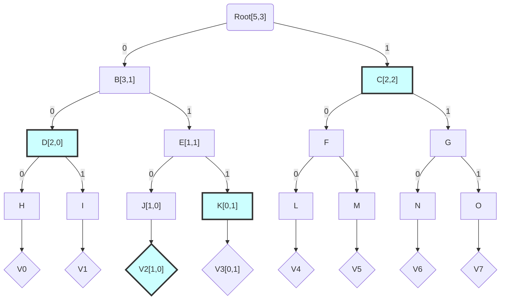

  
{  
"title": "Blockchain Voting Techniques"  
} 

# Blockchain Voting Techniques

## A Blockchain as a public record
* Permanent public record of vote
* Allows permissionless independent and potentially open source vote tallies
* Orders repeat votes (allowing unambiguous discarding of one), or prevents repeats
* Provides registration & communication mechanism
* Public record of number of registrations & participants

* Cannot be the voter registration authority (Sybil attack)1

A blockchain represents a public commitment of ordered data.  This data repository can be used to record votes in a variety of ways.  Any interested party can access the blockchain to discover all votes, so long as they know how votes are identified.  

Note that blockchain reorganizations or mining denial-of-service attacks can be used to remove transactions from the blockchain's main chain, but cannot be used to change a participant's vote.

These activities could affect any election that specifies a moment when polls close.  However, reorganizations leave strong historical evidence of misbehavior in terms of proof-of-work, and denial-of-service attacks leave strong cotemporal evidence (e.g. any participant actively monitoring the network during the voting will see vote records posted to the network but not included in the blockchain).

## Blockchain Vote Recording Techniques
 * Data carried in an arbitrary, otherwise unrelated transaction
 * A token payment to a choice of destinations, each destination represents one choice.

## Merkle Tally Tree
*tallies votes in a manner that admits succinct inclusion proofs*

* Merkle inclusion proof can prove that a particular vote was counted in O(log N) data
* But cannot prove no "ballot stuffing"

Extend a normal merkle tree at each node N with vote tallies of the sum of all the votes in the subtree rooted at N.  The node hashes must concatenate the child hashes as in a normal Merkle tree and the vote tallies to ensure that the tallies cannot be modified without forcing the higher Merkle node hashes to change.  The merkle tree root therefore contains the election results.  

Providing a more formal construction:

Assume a vote with different yes/no decisions $D_n$, functions LeftChild and RightChild that return Merkle tree children, H is a cryptographic hash function, and the operator "|" is byte string concatenation:

$$
Tally(N, D_i)= Tally(LeftChild(N).D_i + RightChild(N).D_i)  \tag1
$$

Merkle Node hash calculation:
$$
H(N) = H(Tally(N, D_x)) | H(LeftChild(N)) | H(RightChild(N))  \tag2
$$

The merkle tree leaf nodes are the hash of a vote, and participant information (such as the blockchain transaction or transaction hash, public key & signature) P, that proves the validity of the vote: 
$$
Tally(P, D_i) = \left\{ \begin{array}{l}
     \verb|1 if vote "yes" for decision D_i| \\
     \verb|0 otherwise|
 \end{array} \right. \tag3
$$

$$
V_n = H(Tally(P,D_x) | P) \tag4
$$

The following diagram illustrates the merkle tree of votes.  Vote tallies appear in brackets.  For brevity, tallies have been omitted from many nodes, except those that are part of the merkle proof of vote $V_2$, which is indicated in light blue.  

So the Merkle proof is "$V_2[1,0]$, K[0,1], D[2,0], and C[2,2] at index 2".

As with normal Merkle trees, specifying index 2 is required to communicate the data concatenation order at each level.  To explain, note that the Merkle proof execution for the provided example begins as follows:

$$
 x \leftarrow H(V_2[1,0])  \tag{a1}
$$

$$
x \leftarrow H(x | K[0,1])  \tag{a2}
$$

$$
x \leftarrow H(D[2,0] | x), ... \tag{a3}
$$
But how did the algorithm "know" to switch the order of concatenation in the last operation?  The answer is by using the element index.

To explain, note that the path from the root to child nodes are labelled with a 0 or 1.  Traversing any path and interpreting these a bits in a number results in the zero based element index of the vote in the tree, in this case its index 2 or 010 binary.  Starting with the least significant bit, use each bit to communicate to the prover the concatenation order (e.g. H(current val, next) or H(next, current val)) of the hash at each tree level, ignoring the bottom-most level which does not concatenate any elements.  For example the 2nd hash operation (a2, combining J and K) executes H(current value J | K[0,1]) because the first bit is 0, but the 3rd hash operation (a3, combining D and E) executes H( D[2,0] | current value E)  -- note the different order -- because the next bit in the index is a 1.  Therefore the index number of the merkle leaf communicates the prover in what order the proof elements must be combined.  

An incorrectly specified index would result in the prover hashing data in the wrong order, yielding a different merkle root and therefore a failed merkle proof.   So a correct merkle proof also proves a vote's position in the tree.

Actually, this additional index data can be eliminated if the hash function is commutative5, if there is no other use for it.  A simple commutative hash function CH based on cryptographic hash H is CH(x,y) = H(sort(x,y))

## Tokens
* Issued 1 to each voter by the registration authority
* Confers permission to participate in a vote.  Each token allows exactly 1 vote, enforced by blockchain token semantics

Note that either the "data carrier" or "destination" voting architectures are possible using tokens.

## Token Shuffle

* Enables voter anonymity from the registration authority and the public
* Participant can still validate their vote it is cast

A token shuffle is CoinJoin2, CashShuffle3, or an equivalent algorithm applied to the tokens that confer permission to participate in a vote, rather than currency.

A coin join is a very simple concept so is described briefly here:  

A transaction may consist of many inputs and many outputs.  Let us propose that many individuals contribute a single input of one token and receive a single output of one token (to a different address from their input) into a single transaction.  If the order of the inputs does not correspond to the order of the outputs, and the input and output quantities are all the same, it is impossible to determine which input corresponds to which output.  This process can be repeated with different partners to increase the pool of possible entities that may control a particular output.

The traditional coin shuffle suffers from a problem with varying input quantities:  Its possible to connect inputs to outputs if participants include different quantities because each participants' quantity must be preserved.  However, this is not a problem for voting tokens since each participant has exactly 1.

Also note that actual construction of the multi-participant transaction may leak identity information or suffer denial-of-service attacks, so implementations are significantly more complex than this conceptual description.

## Voting Topic and Data Commitments

* Ensures integrity of voter choices
	* Cannot omit a choice, add extra choices, or swap choices to identifiers for a subset of voters
* Prevents vote replay

Apply a cryptographic hash to the complete voting information and choice data to create an identifier that probabilistically uniquely identifies the vote session.  Participants and network software can compare identifiers to ensure they have the correct data.  The larger network can reject unknown identifiers which might notify participants of misbehaving or malicious software.  Identifiers should be included in each participant's vote so that the vote itself affirms its vote on a particular topic with the particular topic data.  This prevents both malicious topic data and replay attacks.

## Fake Vote Commitments

* Increase anonymity
* Plausible deniability (for a while) for  participants by handing out fakes
	* Hard to intimidate voters by threatening since participants can produce a fake vote.
	* This would make it hard for participants to sell their vote because participants who voted differently can provide a fake proof to get the money
* obfuscates ongoing counts 

The voting registration authority creates a number of fake votes and commits to those votes via a cryptographic hash.  The fakes are issued during the election process.  When the polls close, the fake votes are revealed and the cryptographic hash proves all the fakes.  Revealing partial fakes results in a non-matching hash so it is not possible to affect the election outcome via a partial reveal.

## Vote Encryption

 * Votes are encrypted using a public/private keypair, which is revealed when all votes are cast
 * Key could be an aggregate
 * Problem: Entity controlling key reveal or last reveal of an aggregate key could choose not to reveal if they do not like the election results.

## ZK-SNARKs

TBD

## References

[1]:  The Sybil Attack: https://www.microsoft.com/en-us/research/publication/the-sybil-attack/
[2]: CoinJoin: https://bitcointalk.org/?topic=279249
[3]: CoinShuffle:  https://www.darrentapp.com/pdfs/coinshuffle.pdf,  https://github.com/cashshuffle/spec
[5]: Commutative Merkle trees: https://medium.com/@g.andrew.stone/tree-signature-variations-using-commutative-hash-trees-4a8a47d4f8ce