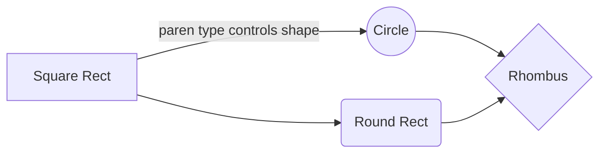
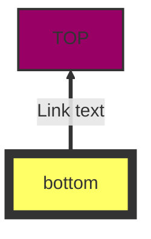
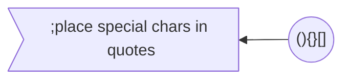
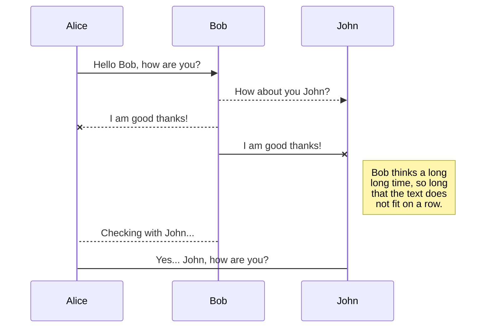

{
"title": "CWIK"
} 

## Overview

*Cwik* (pronounced 'quick') is an editable documentation web site (wiki) that is quite different from what has been done before:

 - All pages are stored in an enhanced Markdown format
 - Pages are stored in a source control system (git)
 - Edits are signed by cryptocurrency tokens
 - Integrated with source code documentation generators

## Enhanced Markdown
Here are some examples:

### Math
[Full Documentation](https://katex.org/docs/supported.html)
The *Gamma function* satisfying $\Gamma(n) = (n-1)!\quad\forall n\in\mathbb N$ is via the Euler integral
$$
\Gamma(z) = \int_0^\infty t^{z-1}e^{-t}dt\,.
$$

### Flowchart
[Full Documentation](https://mermaidjs.github.io/#/flowchart)

### Protocol (Sequence) diagram
[Full Documentation](https://mermaidjs.github.io/#/sequenceDiagram)

## Git storage

Your changes accumulate in local storage on the server.  Press the "commit" button (upper right) to commit all edits.

Look here: https://github.com/bitcoin-unlimited/BUwiki to see the backing repository.

## Token Integration
C

## Source Documentation Generation
TBD